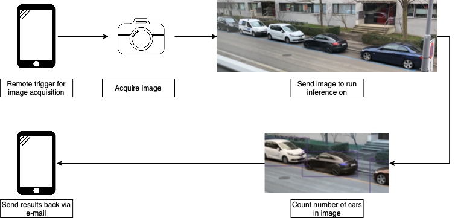

# Parking Space detection
## 0 Purpose
The purpose of this library is to setup a remotely accessible camera that scans a static location for available 
parking spots and informs the user about it (i.e., you should be able to trigger a camera via phone/email 
and receive a message/email about whether a given parking area has a free spot available or not)

## 1 Setup
### 1a Conda environment
Install the corresponding conda environment via   
```TBD```

### 1b Testing
- Unit tests  
Run unit tests via  
```python -m unittest tests/```  
Note: if you are using PyCharm, I would recommend to setup the testing environment as is shown [here](https://www.jetbrains.com/help/pycharm/testing-your-first-python-application.html#create-test)
- Integration tests  
__TBD__

### 1c Formatting
Run black code formatting from the project root directory via  
```black --line-length 120 .```  
Note: if you are using PyCharm, I would recommend to setup black as is shown [here](https://godatadriven.com/blog/partial-python-code-formatting-with-black-pycharm/) as default code formatter with the additional argument `line-length 120` triggered during every _save_ operation.  
Black version used in the code is 21.12b0.

## 2 Personal Project Description
This Repo is built for the purpose of remote parking space monitoring and based on 2 main parts (and 4 resulting features) 
1. Image acquisition part:
- Feature A > Camera setup: Building a camera setup that allows remote access (e.g., via smartphone)
- Feature B > Server setup: Sending the acquired image to a (remote) server
2. Computer Vision part:
- Feature C > Parking space detection: Detection of free parking space based on acquired image
- Feature D > Information sharing: Sharing of results (e.g., just sharing raw image and/or Yes-No result of CV algorithm - i.e., yes there is a free parking spot)

### Feature A > Camera setup:
Requirements:
- Needs to be accessible remotely (e.g., via smartphone and/or computer) - e.g., send an e-mail to server -> image acquisition is triggered
Initial idea of solution:
- Hook up camera to RaspberryPi which is connected to WiFi
- Triggering TBD
- Image needs to be uploaded to server (can be just simple sharing to Laptop in beginning)

### Feature B > Server setup:
- TBD -> Can be done on local machine in beginning; AWS EC2 instance later

### Feature C > Parking space detection:
- Probably some simple CNN (e.g., from detectron2) - but should be able to fine-tune based on specific scene of interest (which will be static - i.e., always the same)

### Feature D > Information sharing:
- Once results are available, should be shared via e-mail - (can be just sharing of the raw image in beginning)

## 3 Implementation status 
| Feature                     | Level 1 (Description)                                                                            | L1 (Status)        | Level 2 (Description) | L2 (Status) | Level 3 (Description) | L3 (Status) |
|-----------------------------|--------------------------------------------------------------------------------------------------|--------------------|-----------------------|-------------|-----------------------|-------------|
| A > Camera setup            | Standalone camera module connected to Wifi (e.g., RaspberryPi)                                   | -                  | -                     | -           | -                     | -           |
| B > Server setup            | _tbd: will likely do this last and run computations locally first_                               | -                  | -                     | -           | -                     | -           |
| C > Parking space detection | Yolov4-tiny to infer number of cars in image (and if less than given number -> assume free spot) | :white_check_mark: | -                     | -           | -                     | -           |
| D > Information sharing     | Programmatically send plain-text e-mail to specified address                                     | :white_check_mark: | Send attachments      | -           | -                     | -           |
